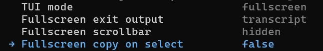
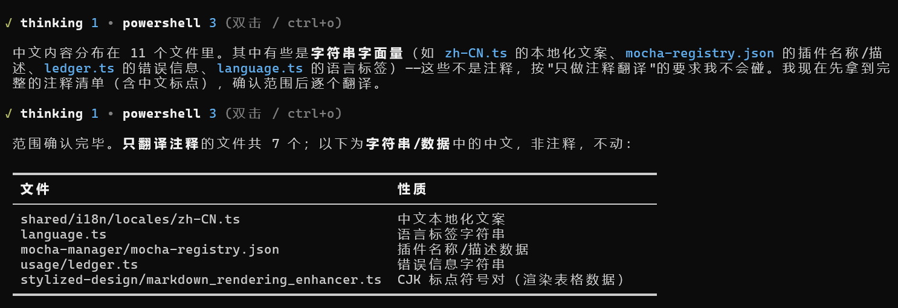
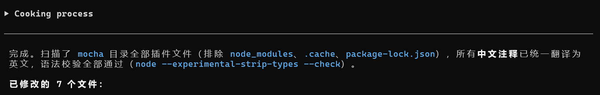
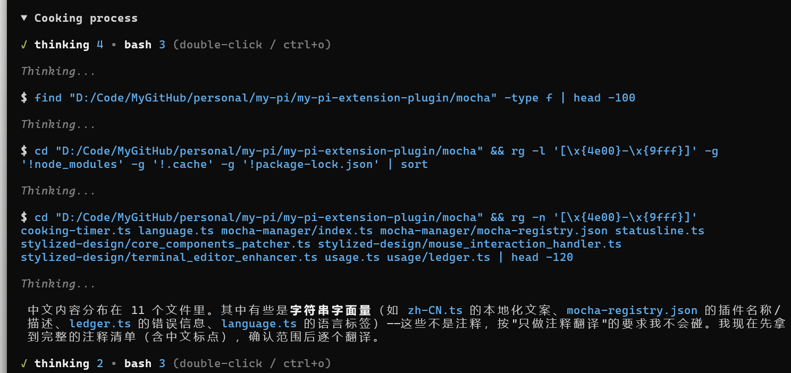
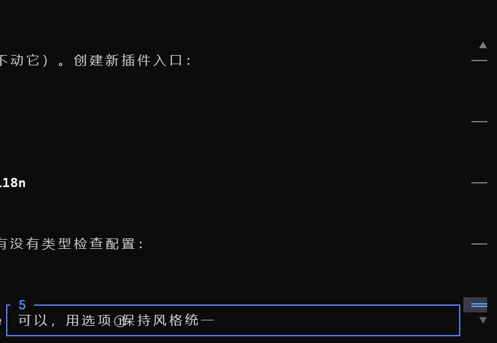
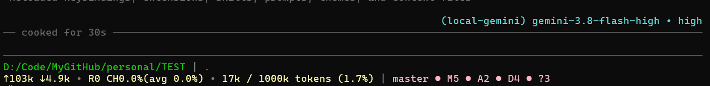
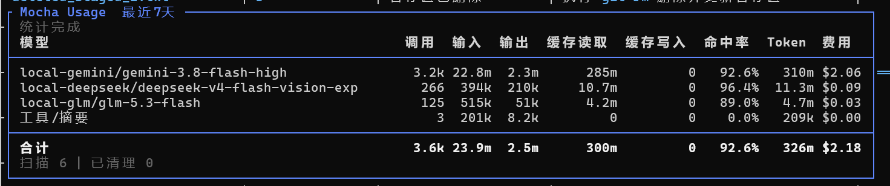
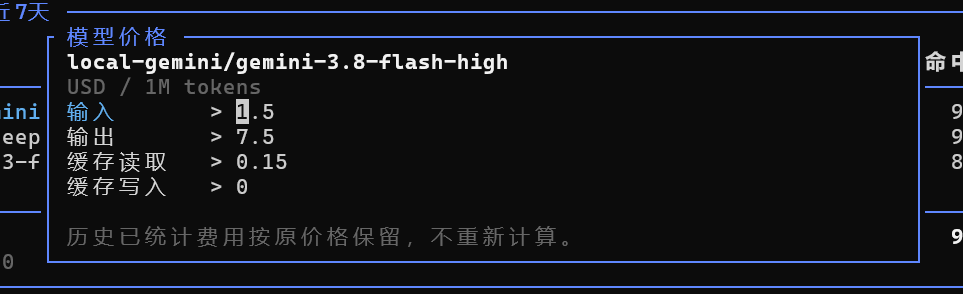

# MPEP

[English](README.md) | 简体中文

一个轻量化的优化 pi 的外壳界面的插件集合。

完全依赖于 pi 自身的扩展机制，零源码修改，轻量装卸。

> **强烈建议在 pi 的全屏模式（在 `/settings` 的 TUI mode 中选择 full screen）下配合使用该插件，以获得最好效果。**
>
> 以此参照设置最佳
>
> 

### 界面优化

紧凑工具输出、详情展开、 Markdown 渲染增强等。

执行中界面优化



本轮结束后会自动折叠（说完、Abort、中途插话都一样）



可双击展开



### 轮次导航

在右侧添加轮次导航，可以快速查看每轮的用户指令并点击转跳



### 状态栏

状态栏在 pi 原生的基础上进行一定改善

模型、项目、Git 和 Token 用量信息等各类数据显示。



### 用量统计

Token 用量、费用、每日汇总和模型价格编辑。





### 主题分发

内置 `mpep-blue` 蓝色主题。首次加载时自动安装到 `~/.pi/agent/themes/` 并选中该主题。安装是一次性的：如果主题文件已存在，则不会覆盖你手动选择的主题。

通过 `/m-mng` 禁用该插件即等于卸载：删除主题文件，并还原安装前使用的主题（无记录时回退到 pi 默认的 `dark`）。

### 快捷键优化

- 取消了Ctrl+C清空输入框文本的行为。
- 支持鼠标自由选中文本的情况下进行Ctrl+C复制而不是退出pi，并且对没选中内容时候按下Ctrl+C做了二次确认防止误触推出pi。
- 支持鼠标自由选中文本的情况下进行文本的直接删除（Backspace / Delete）和覆写（Ctrl+V）。
- 支持鼠标自由选中文本的情况下行文本的剪切操作（Ctrl+X）。
- Ctrl+- / Ctrl+_进行撤销操作，Windows端额外支持Ctrl+Z。

注：TPS插件源自于[Pi](https://github.com/earendil-works/pi)官方仓库实现。

### 安装与更新

```bash
pi install git:github.com/mocha114514/better-pi-appearance
pi update git:github.com/mocha114514/better-pi-appearance
```

### 卸载

```bash
pi remove git:github.com/mocha114514/better-pi-appearance
```

然后手动删除 `~/.pi/agent/mpep-cache/` 即可彻底清理。

### 常用指令

| 指令                 | 用途                          |
| -------------------- | ----------------------------- |
| `/m-mng`             | 启用和禁用你喜欢/不喜欢的扩展 |
| `/m-mng list`        | 查看插件状态                  |
| `/m-lgg`             | 中文/英文选择                 |
| `/m-usg` / `/-usg n` | 查看用量与费用统计            |

### 数据位置

- 配置、插件开关和用量数据统一保存在 **`~/.pi/agent/mpep-cache/`**，与安装目录分离。设置 `PI_CODING_AGENT_DIR` 时会跟随该目录；项目级安装也使用同一用户数据目录。

## License

[MIT](LICENSE) · Copyright (c) 2026 mocha114514
